[](https://github.com/gongahkia/cruella/releases/tag/1.0.0)

# `Cruella`

[POSIX](https://en.wikipedia.org/wiki/POSIX)-compliant Static Site, Slides and PDF generator and publisher written in [Bash]().

`Cruella` works on any [Markdown](https://www.markdownguide.org/) folder.

## Stack

* *Script*: [Bash](https://www.gnu.org/software/bash/)
* *Dependencies*: [Pandoc](https://pandoc.org/), [Reveal.js](https://revealjs.com/),  [Python](https://www.python.org/), [rsync](https://linux.die.net/man/1/rsync)
* *CI/CD*: [Github Actions](https://github.com/features/actions)

## Usage

The below instructions are for running `Cruella` on your client machine.

1. Execute the below.

```console
$ git clone https://github.com/gongahkia/cruella && cd cruella && chmod +x bin/*
```

2. Place all Markdown files within [`./content/`](./content/).
3. Then run any of the following.

| Command | Purpose |
| :--- | :--- |
| `bin/cruella build html` | Build HTML site from Markdown files |
| `bin/cruella build pdf` | Build PDFs from Markdown files |
| `bin/cruella build slides` | Build Slides from Markdown files |
| `bin/cruella build all` | Run all Build Scripts |
| `bin/cruella clean` | Remove all generated files |
| `bin/cruella help` | Show all available commands |
| `bin/cruella serve` | Serve any dirctory (`./public` by default) at [localhost:8000](http://localhost:8000) |
| `export DEPLOY_DEST="user@server:/var/www/html" && bin/cruella deploy` | Deploy the `public/` directory to a remote server |

## Architecture

```mermaid
flowchart TD
  %% Frontend Cluster
  subgraph Frontend["Frontend (React App, Static Site, CLI)"]
    direction TB
    FE1[App.js<br><span style="color:#1f77b4;font-weight:bold;">Main React UI</span>]
    FE2[api.js<br><span style="color:#9467bd;">REST API bridge</span>]
    FE3[SheetTable.js<br><span style="color:#2ca02c;">Sheets UI</span>]
    FE4[DocViewer.js<br><span style="color:#d62728;">Docs UI</span>]
    FE5[SlidesViewer.js<br><span style="color:#ff7f0e;">Slides UI</span>]
    FE6[public/<br><span style="color:#8c564b;">Static assets</span>]
    FE7[cruella CLI<br><span style="color:#bcbd22;">Main entrypoint</span>]
    FE8[build_html.sh<br><span style="color:#2ca02c;">Markdown → HTML</span>]
    FE9[build_pdf.sh<br><span style="color:#d62728;">Markdown → PDF</span>]
    FE10[build_slides.sh<br><span style="color:#ff7f0e;">Markdown → Slides</span>]
    FE11[serve.sh<br><span style="color:#17becf;">Local HTTP server</span>]
    FE12[deploy.sh<br><span style="color:#e377c2;">Deployment utility</span>]
    FE13[utils.sh<br><span style="color:#7f7f7f;">Shared shell utils</span>]
  end

  %% Backend Cluster
  subgraph Backend["Backend (Python, Flask/FastAPI)"]
    direction TB
    BE1[Server Entrypoint<br><span style="color:#1f77b4;font-weight:bold;">REST API</span>]
    BE2[docs_logic.py<br><span style="color:#d62728;">Docs API logic</span>]
    BE3[sheets_db.py<br><span style="color:#2ca02c;">Sheets API logic</span>]
    BE4[slides_frontend.py<br><span style="color:#ff7f0e;">Slides API logic</span>]
    BE5[automation.py<br><span style="color:#9467bd;">Orchestration</span>]
  end

  %% Config Cluster
  subgraph Config["Config & Secrets"]
    direction TB
    CFG1[.env / .env.example<br><span style="color:#17becf;">Environment variables</span>]
    CFG2[credentials.json<br><span style="color:#bcbd22;">Google Service Account</span>]
  end

  %% Scripts Cluster
  subgraph Scripts["Automation & Utility Scripts"]
    direction TB
    SC1[sample_scripts.py<br><span style="color:#e377c2;">API samples</span>]
    SC2[list_drive_files.py<br><span style="color:#7f7f7f;">Drive listing</span>]
    SC3[batch_update_sheets.py<br><span style="color:#bcbd22;">Batch Sheets update</span>]
    SC4[generate_dummy_data.py<br><span style="color:#17becf;">Test data generator</span>]
  end

  %% Tests Cluster
  subgraph Tests["Automated Tests"]
    direction TB
    TB1[tests/backend/<br><span style="color:#c49c94;">Backend unit/integration</span>]
    TF1[tests/frontend/<br><span style="color:#f7b6d2;">Frontend UI/unit</span>]
  end

  %% Templates Cluster
  subgraph Templates["Templates & Styling"]
    direction TB
    T1[base.html<br><span style="color:#1f77b4;">HTML template</span>]
    T2[sidebar.html<br><span style="color:#9467bd;">Sidebar partial</span>]
    T3[style.css<br><span style="color:#2ca02c;">Responsive CSS</span>]
    T4[slides.html<br><span style="color:#ff7f0e;">Slides template</span>]
  end

  %% Content/Output Cluster
  subgraph Content["Content & Outputs"]
    direction TB
    C1[content/<br><span style="color:#bcbd22;">Markdown files</span>]
    C2[public/<br><span style="color:#8c564b;">Generated HTML site</span>]
    C3[pdfs/<br><span style="color:#d62728;">Generated PDFs</span>]
    C4[slides/<br><span style="color:#ff7f0e;">Generated slides</span>]
  end

  %% Google APIs Cluster
  subgraph GoogleAPIs["Google APIs"]
    direction TB
    GDocs[Google Docs API<br><span style="color:#d62728;">docs.googleapis.com</span>]
    GSheets[Google Sheets API<br><span style="color:#2ca02c;">sheets.googleapis.com</span>]
    GSlides[Google Slides API<br><span style="color:#ff7f0e;">slides.googleapis.com</span>]
    GDrive[Google Drive API<br><span style="color:#7f7f7f;">drive.googleapis.com</span>]
    OAuth[Google OAuth 2.0<br><span style="color:#1f77b4;">Authentication</span>]
  end

  %% Frontend to Backend
  FE1 -- "calls via axios" --> FE2
  FE2 -- "HTTP REST" --> BE1
  FE3 -- "renders sheet data" --> FE1
  FE4 -- "renders doc content" --> FE1
  FE5 -- "renders slides" --> FE1
  FE6 -- "static assets" --> FE1

  %% CLI/Static Site Toolchain
  FE7 -- "calls" --> FE8
  FE7 -- "calls" --> FE9
  FE7 -- "calls" --> FE10
  FE7 -- "calls" --> FE11
  FE7 -- "calls" --> FE12
  FE7 -- "sources" --> FE13
  FE8 -- "uses templates" --> T1
  FE8 -- "uses sidebar" --> T2
  FE8 -- "uses style" --> T3
  FE9 -- "uses templates" --> T1
  FE10 -- "uses slides template" --> T4
  FE10 -- "uses style" --> T3
  FE8 -- "reads" --> C1
  FE9 -- "reads" --> C1
  FE10 -- "reads" --> C1
  FE8 -- "outputs" --> C2
  FE9 -- "outputs" --> C3
  FE10 -- "outputs" --> C4

  FE11 -- "serves" --> C2
  FE12 -- "deploys" --> C2

  %% Backend to Google APIs
  BE1 -- "calls" --> BE2
  BE1 -- "calls" --> BE3
  BE1 -- "calls" --> BE4
  BE1 -- "calls" --> BE5

  BE2 -- "requests" --> GDocs
  BE3 -- "requests" --> GSheets
  BE4 -- "requests" --> GSlides
  BE5 -- "orchestrates" --> BE2
  BE5 -- "orchestrates" --> BE3
  BE5 -- "orchestrates" --> BE4

  %% Config usage
  BE1 -. "reads env" .-> CFG1
  BE1 -. "reads creds" .-> CFG2
  BE2 -. "reads creds" .-> CFG2
  BE3 -. "reads creds" .-> CFG2
  BE4 -. "reads creds" .-> CFG2
  BE5 -. "reads creds" .-> CFG2

  %% Scripts to Backend and APIs
  SC1 -- "sample API calls" --> BE2
  SC1 -- "sample API calls" --> BE3
  SC1 -- "sample API calls" --> BE4
  SC2 -- "lists files" --> GDrive
  SC3 -- "batch update" --> GSheets
  SC4 -- "populate test data" --> GSheets

  %% Tests
  TB1 -- "unit/integration" --> BE2
  TB1 -- "unit/integration" --> BE3
  TB1 -- "unit/integration" --> BE4
  TB1 -- "integration" --> BE5
  TF1 -- "UI/component" --> FE1
  TF1 -- "UI/component" --> FE3
  TF1 -- "UI/component" --> FE4
  TF1 -- "UI/component" --> FE5

  %% OAuth
  BE1 -- "OAuth 2.0" --> OAuth
  FE1 -- "User login" --> OAuth

  %% Google APIs interrelation
  GDocs -. "may reference data in" .-> GSheets
  GSlides -. "visualizes data from" .-> GDocs
  GSlides -. "visualizes data from" .-> GSheets

  %% Data Flow Highlights
  classDef blue fill:#eaf3fb,stroke:#1f77b4,stroke-width:2px;
  classDef green fill:#eafbe7,stroke:#2ca02c,stroke-width:2px;
  classDef red fill:#fbeaea,stroke:#d62728,stroke-width:2px;
  classDef orange fill:#fff4e6,stroke:#ff7f0e,stroke-width:2px;
  classDef purple fill:#f3eafc,stroke:#9467bd,stroke-width:2px;
  classDef yellow fill:#fdfbe6,stroke:#bcbd22,stroke-width:2px;
  classDef teal fill:#e6f8fa,stroke:#17becf,stroke-width:2px;
  classDef brown fill:#f7f4f2,stroke:#c49c94,stroke-width:2px;
  classDef pink fill:#fce6f3,stroke:#e377c2,stroke-width:2px;
  classDef gray fill:#f3f3f3,stroke:#7f7f7f,stroke-width:2px;

  class FE1,BE1,OAuth blue
  class FE2,BE5,T2 purple
  class FE3,BE3,GSheets,T3 green
  class FE4,BE2,GDocs,T1 red
  class FE5,BE4,GSlides,T4 orange
  class FE6 gray
  class FE7,SC3 yellow
  class FE8,SC4 teal
  class FE9,SC1 pink
  class FE10,SC2 gray
  class FE11 teal
  class FE12 pink
  class FE13 gray
  class CFG1 teal
  class CFG2 yellow
  class TB1 brown
  class TF1 pink
  class C1 yellow
  class C2 gray
  class C3 red
  class C4 orange
  class GDrive gray
```



## Reference

The name `Cruella` is in reference to [Cruella de Vil](https://disney.fandom.com/wiki/Cruella_De_Vil), the main antagonist of the [Disney](https://disney.fandom.com/wiki/Walt_Disney_Productions) classic [One Hundred and One Dalmatians](https://disney.fandom.com/wiki/One_Hundred_and_One_Dalmatians).

<div align="center">
    
</div>

## Credits

`Cruella` is greatly inspired by the following projects.

* [davidmerfield/Blot](https://github.com/davidmerfield/Blot)
* [jekyll/jekyll](https://github.com/jekyll/jekyll)
* [11ty/eleventy](https://github.com/11ty/eleventy/)
* [gohugoio/hugo](https://github.com/gohugoio/hugo)
* [getzola/zola](https://github.com/getzola/zola)