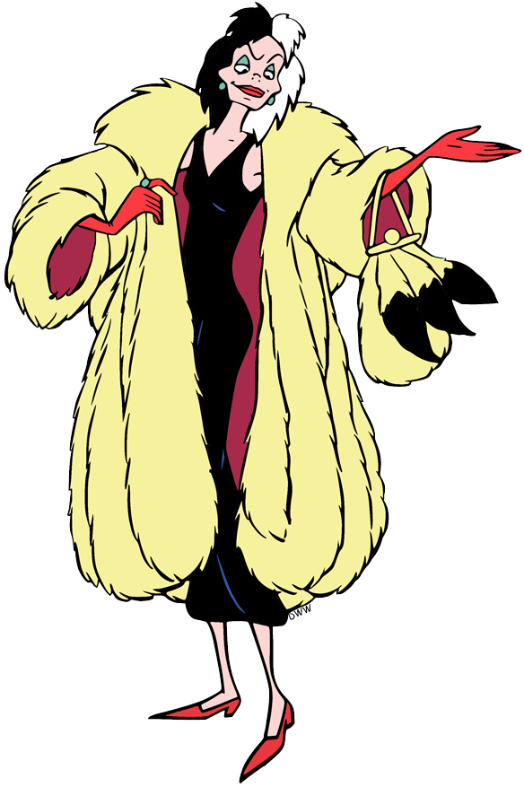

[](https://github.com/gongahkia/cruella/releases/tag/1.0.0)

# `Cruella`

...

## Stack

* *Script*: [Bash](https://www.gnu.org/software/bash/)

## Usage

The below instructions are for running `Cruella` on your client machine.

1. Execute the below.

```console
$ git clone https://github.com/gongahkia/cruella && cd cruella

2. ...

## Architecture

```mermaid

```

## Reference

The name `Cruella` is in reference to [Cruella de Vil](https://disney.fandom.com/wiki/Cruella_De_Vil), the main antagonist of the [Disney](https://disney.fandom.com/wiki/Walt_Disney_Productions) classic [One Hundred and One Dalmatians](https://disney.fandom.com/wiki/One_Hundred_and_One_Dalmatians).

<div align="center">
    
</div>
